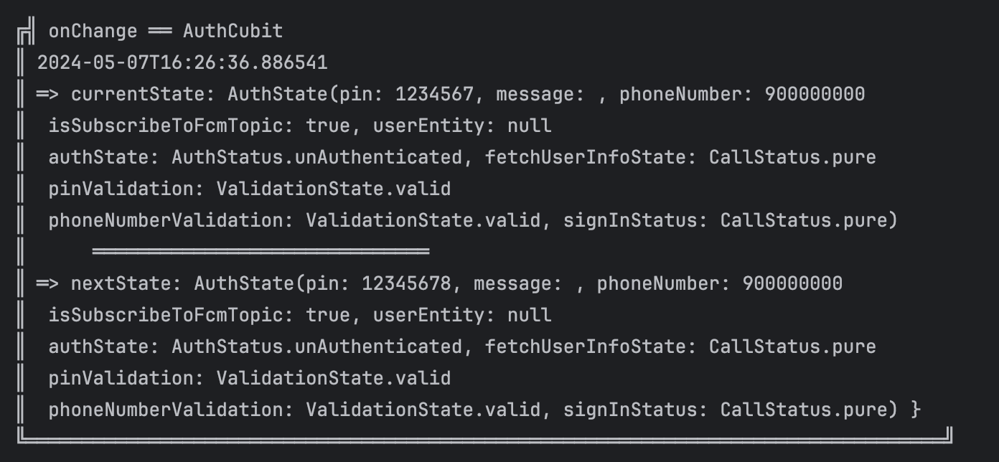

# Pretty Bloc Observer

Pretty Bloc Observer is a Flutter package that provides a Bloc observer for printing Bloc and Cubit state changes in a formatted and visually appealing way. It allows you to easily visualize the changes happening within your Blocs and Cubits during development.

## Features

- Formats Bloc and Cubit state changes for easy readability.
- Customizable output for different state change events.
- Supports splitting long lines to improve readability.
- Compatible with both Bloc and Cubit from the Flutter Bloc package.

How it looks like



## Installation

To use Pretty Bloc Observer in your Flutter project, add the following to your `pubspec.yaml` file:

```yaml
dependencies:
  pretty_bloc_observer: ^1.0.0
```

Then run `flutter pub get` to install the package.

## Usage

To use Pretty Bloc Observer in your Flutter project, simply import it and add it to your Bloc/Cubit:

```dart
import 'package:flutter/material.dart';
import 'package:flutter_bloc/flutter_bloc.dart';
import 'package:pretty_bloc_observer/pretty_bloc_observer.dart';

void main() {
  Bloc.observer = PrettyBlocObserver();
  runApp(MyApp());
}
```

## Example

```dart
// Import Pretty Bloc Observer
import 'package:flutter_bloc/flutter_bloc.dart';
import 'package:pretty_bloc_observer/pretty_bloc_observer.dart';

void main() {
  // Set Pretty Bloc Observer as the Bloc observer
  Bloc.observer = PrettyBlocObserver();

  runApp(MyApp());
}
```

## License

This project is licensed under the [MIT License](LICENSE).
